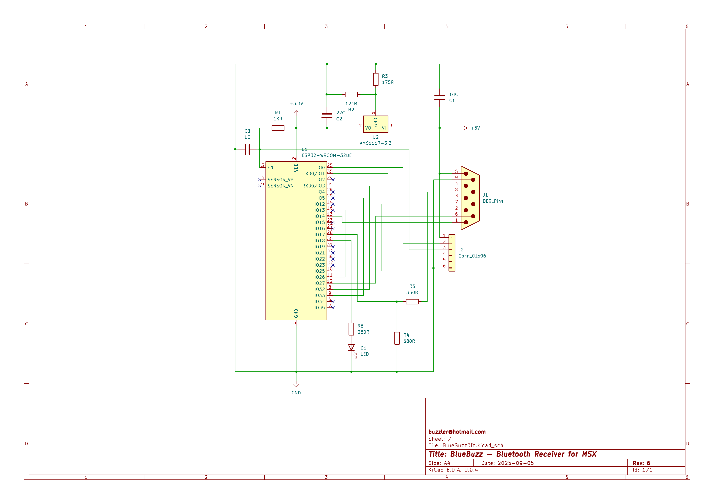

# BlueBuzz for MSX (ESP32 Edition)

**BlueBuzz** is an ESP32-based adapter that enables wireless gamepad, mouse, and keyboard input for MSX computers via Bluetooth. It uses the [Bluepad32](https://github.com/ricardoquesada/bluepad32) library for Bluetooth HID support and maps controller input to the MSX joystick/mouse port.

---

## Features

- **Bluetooth Gamepad Support:** Connect modern Bluetooth controllers (Xbox, PlayStation, 8BitDo, etc.) and use them as MSX joysticks.
- **Bluetooth Mouse Support:** Use Bluetooth mice for full MSX mouse compatibility.
- **Bluetooth Keyboard Support:** Use a Bluetooth keyboard as an MSX joystick.
- **Turbo (Rapid Fire):** Adjustable turbo for A/B buttons, controlled by shoulder/trigger buttons.
- **Rumble Feedback:** Controller vibration when turbo speed limits are reached.
- **Auto Sleep:** ESP32 enters sleep mode after inactivity.
- **Bluetooth Key Management:** Press SELECT + START to clear all Bluetooth pairings.

---

## Hardware Requirements

- **ESP32 development board** (e.g., WROOM, TinyPICO)
- **MSX computer** (with joystick/mouse port)
- **Level shifter** (recommended for safe 3.3V ↔ 5V interfacing)
- **Wiring** to connect ESP32 GPIOs to the MSX DB9 port

---

## Pin Mapping

Default pin mapping for ESP32 WROOM 32 (see `PLAYER_PINS` in the code):

| MSX Signal | ESP32 GPIO | Description         |
|------------|------------|---------------------|
| UP         | 14         | Direction/Mouse D3  |
| DOWN       | 26         | Direction/Mouse D2  |
| LEFT       | 33         | Direction/Mouse D1  |
| RIGHT      | 32         | Direction/Mouse D0  |
| A          | 27         | Button A/Mouse Left |
| B          | 25         | Button B/Mouse Right|
| OUT        | 17         | OUT/Strobe          |
| LED        | 18         | Status LED          |

> Adjust the `PLAYER_PINS` array in the code for your board or wiring.

---

## Software Requirements

- [Arduino IDE](https://www.arduino.cc/en/software)
- [Bluepad32 library](https://github.com/ricardoquesada/bluepad32)
- ESP32 board support for Arduino

---

## Installation & Setup

1. **Copy the Project:**
    - Place `BlueBuzz.ino` in your Arduino sketch directory.

2. **Install Bluepad32:**
    - Follow the [Bluepad32 GitHub instructions](https://github.com/ricardoquesada/bluepad32) to install the library.

3. **Configure Board:**
    - Select your ESP32 board in the Arduino IDE.
    - Edit `PLAYER_PINS` in the code if needed.

4. **Connect Hardware:**
    - Wire ESP32 GPIOs to the MSX joystick/mouse port according to the pin mapping.
    - Use a level shifter if necessary.

5. **Upload Firmware:**
    - Compile and upload `BlueBuzz.ino` to your ESP32.

6. **Pair Bluetooth Controller:**
    - Put your controller, mouse, or keyboard in pairing mode.
    - The ESP32 will automatically pair and manage connections.

---

## Usage

- **Gamepad Mode:** Use the D-pad, analog sticks, and buttons as an MSX joystick.
- **Turbo:** Hold X (for A) or Y (for B) to enable turbo. Adjust turbo speed with shoulder/trigger buttons.
- **Mouse Mode:** Move the mouse and click buttons for MSX mouse input (data sent as two's complement 8-bit values).
- **Keyboard Mode:** Use arrow keys/WASD for directions, N/Space/Enter for A, M/Esc for B.
- **Forget Controllers:** Press SELECT + START simultaneously to clear all paired devices.

---

## MSX Mouse Signal Details

- **UP/DOWN/LEFT/RIGHT (pins 1–4):** Carry 4 bits of mouse data (X/Y movement, two's complement, 8 bits total per axis).
- **A/B (pins 6,7):** Mouse left/right button state.
- **OUT (pin 9):** Strobe/clock signal from MSX to request data.

---

## Troubleshooting

- **No Input on MSX:** Check wiring, pin mapping, and level shifting.
- **Bluetooth Pairing Issues:** Use the forget controllers feature or reset the ESP32.
- **Laggy Input:** Adjust `delay_ms` in the code for optimal performance.

---

## License

This project is licensed under the GNU General Public License v3.0 (GPL-3.0).

---

## Credits

- [Bluepad32](https://github.com/ricardoquesada/bluepad32) by Ricardo Quesada

---

Enjoy wireless gaming and mouse control on your MSX with modern
